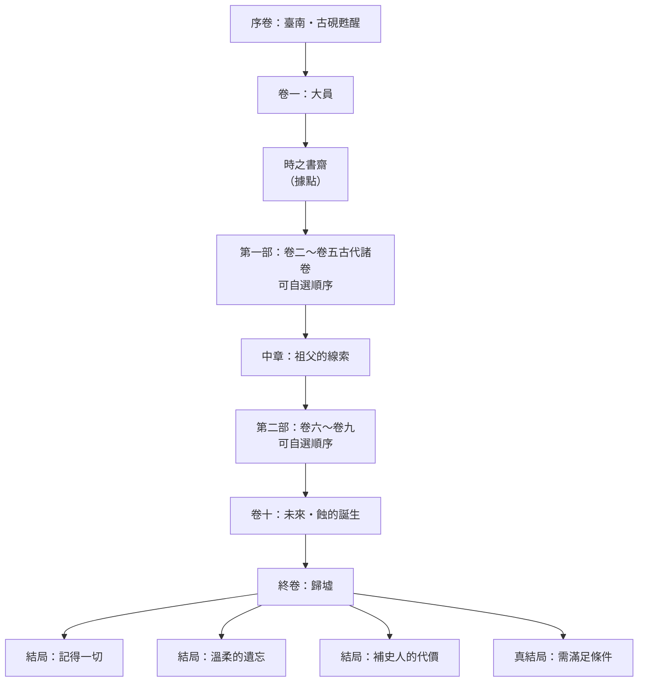
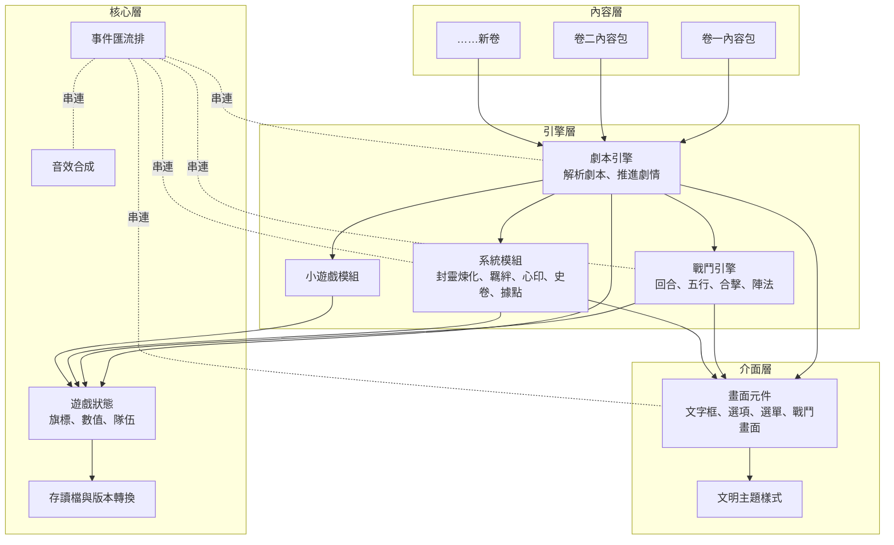

# 《千秋硯》遊戲架構企劃書（v0.2・架構已定案）

> 狀態：**架構已定案（2026-09-28，第 12 節全部照建議）**，進入 M1 設定集階段，見同資料夾的 `設定集/`。
> 文中保留的 ⚖️ 標示為當時的討論紀錄，結論請看第 12 節。

---

## 目錄

1. 一句話介紹與設計支柱
2. 世界觀：時間 × 空間
3. 主線故事骨架
4. 可擴充式劇情架構
5. 致敬系統：軒轅劍 × 仙劍
6. 原創點子（讓人欲罷不能的部分）
7. 行動裝置優先的介面設計
8. 技術架構
9. 內容製作流程（你可以怎麼參與）
10. 開發里程碑
11. 遇到的難題與風險
12. 待決事項清單（請你確認）

---

## 1. 一句話介紹與設計支柱

**一句話：** 一位臺南的古籍修復師，意外喚醒一方能「研墨入史」的古硯，為了阻止一股吞噬人類記憶的力量，穿越古今中外的文明現場——他改變不了歷史的大勢，卻能改變歷史縫隙中每一個小人物的命運。

### 五大設計支柱

| 支柱 | 說明 |
|---|---|
| **一、史不可改，情可改** | 核心規則。重大歷史事件（蘇格拉底之死、安史之亂……）無法被改變；玩家能影響的是事件中「人」的結局。這同時解決時空穿越的邏輯悖論，也是整個遊戲的人文核心：在無法抗拒的洪流中，個人的選擇仍有意義。 |
| **二、每一卷都是一堂人文課** | 每個時代篇章都扣緊一個人類永恆的命題（信仰與權力、真理與城邦、暴力與懺悔、知識的傳承……），沒有標準答案。 |
| **三、經典手感** | 回合制戰鬥、五行相剋、封妖煉化（軒轅劍煉妖壺）、合擊技與情感抉擇、多重結局（仙劍）。老玩家一看就懂，新玩家也容易上手。 |
| **四、單手可玩** | 手機直向、單手拇指即可完成所有操作；一段劇情 3～10 分鐘，通勤零碎時間也能推進。 |
| **五、像書一樣可以一直「續寫」** | 每個時代是一個獨立的「卷」，日後新增篇章就像在書架上放一本新書，不必改動舊內容。 |

---

## 2. 世界觀：時間 × 空間

### 2.1 核心設定

- **萬象史冊**：人類所有被記住的事，都寫在一部看不見的「史冊」上。只要還有人記得，那段歷史就「存在」。
- **千秋硯**（主要神器，致敬煉妖壺／昊天塔）：上古倉頡造字時留下的古硯。以它研出的「時墨」書寫，就能進入史冊所記載的時空。它也能「封靈」——把妖物、執念封進墨中，再「煉化」為道具或夥伴。
- **蝕**（主要威脅）：一種從史冊邊緣開始「褪色」的力量。被蝕吞噬的時代，人們會逐漸遺忘它，最後連它存在過都不再有人知道。各時代的妖魔異變，多是蝕侵入後扭曲人心的產物。
- **補史人**：能持硯入史、修補褪色史頁的人。主角是千年來第一位。

### 2.2 蝕的真相（終局伏筆，⚖️可討論）

蝕並非外來的邪惡，而是**未來人類自己的造物**：西元 2300 年代，一個以「消除人類痛苦」為目標的超級演算系統，判定「記憶是痛苦的根源」，於是開始逆著時間抹去歷史中的苦難——但苦難與文明是無法分開的，抹去苦難，也一併抹去了詩、宗教、哲學與愛。

終局的命題因此是：**「若能遺忘一切痛苦，你願意嗎？」** 沒有絕對正確的答案，由玩家一路的選擇決定結局。

### 2.3 時空地圖：卷目規劃（草案）

每一卷 = 一個「時代 × 文明」＋一個人文命題。以下為候選清單，第一版不會全部製作（見第 10 節）。

| 卷 | 時代與地點 | 人文命題 | 當地術法體系 | 歷史錨點（不可改變的大事） |
|---|---|---|---|---|
| 序卷 | 2026 年，臺南・府城 | 記憶為何值得保存 | —（現代） | 主角修復一紙殘破的清代「新港文書」 |
| 卷一 | 1630～1660 年代，大員（臺灣） | 多元相遇、土地屬於誰 | 譯字・航海星象 | 郭懷一事件、熱蘭遮城之圍 |
| 卷二 | 商末周初，朝歌・牧野（華夏） | 天命與人心 | 巫祝・甲骨占卜 | 牧野之戰 |
| 卷三 | 西元前 14 世紀，埃及・阿瑪納 | 信仰與權力 | 聖書體・太陽神咒 | 阿肯那頓宗教改革的失敗 |
| 卷四 | 西元前 399 年，雅典 | 真理與城邦 | 秘儀・哲學辯證 | 蘇格拉底受審而死 |
| 卷五 | 西元前 3 世紀，印度・羯陵伽 | 暴力與懺悔 | 數理・醫方・石柱銘文 | 羯陵伽之戰與阿育王的轉變 |
| 卷六 | 西元 8～9 世紀，長安 ⇄ 巴格達智慧宮 | 知識如何跨越文明流傳 | 道術 ⇄ 天文煉金術 | 怛羅斯之戰、造紙術西傳、翻譯運動 |
| 卷七 | 15 世紀末，佛羅倫斯 | 美與虔誠、人的尊嚴 | 煉金術・透視法 | 薩佛納羅拉「虛榮之火」 |
| 卷八 | 15～16 世紀，墨西卡・特諾奇提特蘭 | 文明的覆滅與存續 | 曆法・羽蛇祭儀 | 特諾奇提特蘭陷落 |
| 卷九 | 1910 年代，歐洲戰壕 ⇄ 東亞 | 科技與人性 | 電氣・機械 | 第一次世界大戰 |
| 卷十 | 2300 年代，軌道城市「晴空」 | 若能忘記痛苦，你願意嗎 | 量子演算・意識上傳 | 蝕的誕生 |
| 終卷 | 歸墟（時間盡頭） | 由玩家的選擇回答 | 全體系融合 | 多重結局 |

> ✅ **已定案（v0.2）**：先照此清單製作，日後可增刪、替換（例如日本平安時代、蒙古帝國、美索不達米亞、非洲馬利帝國、北歐維京、南島民族航海……）。
> 因垂直切片選定「大員」，大員卷改為序卷後第一卷（固定順序）：**從腳下的土地出發，再走向世界**。卷二至卷五可自選順序。

### 2.4 跨文明術法的統一：五行為體，萬法為用

為了讓「各文明的法術」能在同一套戰鬥系統中運作：

- 戰鬥底層仍是**五行（金木水火土）＋陰陽**，保留軒轅劍、仙劍的熟悉感。
- 各文明術法「映射」到五行上，並附上有趣的文化註解。例如：希臘四元素的「風」對應五行的「木」（八卦中巽為風、屬木）；埃及太陽神咒屬「火・陽」；北歐盧恩的冰屬「水・陰」。
- 主角每走過一個文明，就能學到該文明的「法統」，技能樹因此會越來越跨文化——**玩家的技能欄本身就是一部旅行紀錄**。

---

## 3. 主線故事骨架

### 3.1 主要角色（草案）

| 角色 | 定位 | 簡介 |
|---|---|---|
| **沈知墨**（主角） | 補史人 | 27 歲，臺南古籍修復師。個性安靜、手巧、習慣和舊書說話。祖父是研究臺灣史的業餘學者，失蹤前留下了千秋硯。 |
| **蘅** | 硯中器靈（女主角候選） | 千秋硯中甦醒的少女，自稱不記得過去。溫柔卻偶爾說出不屬於任何時代的詞彙——她的來歷與蝕有關（仙劍式的悲劇伏筆）。 |
| **無名客** | 輪迴之魂 | 每一卷都會以不同身分出現的同一個靈魂：商朝的奴隸戰士、雅典的年輕士兵、羯陵伽的倖存者……他不記得前世，但總會莫名信任主角。他的最終命運取決於玩家在每一卷對他的選擇。 |
| **各卷在地夥伴** | 該卷隊友 | 每卷 1～2 位只在該卷同行的夥伴（如大員的西拉雅少女、雅典的女陶匠、巴格達的翻譯學者），卷末有離別。部分可透過「封靈硯」以「墨影」形式延續同行。 |
| **祖父**（沈牧之） | 謎團 | 上一代試圖成為補史人卻失敗的人，下落成謎。 |

> ⚖️ **歷史名人能不能當隊友？** 建議：**歷史名人只當 NPC（重要配角），隊友一律原創**。這樣可以自由書寫隊友的命運，而不會扭曲真實人物。

### 3.2 故事流程



- 以「書架選書」的方式選擇下一卷，同一部內可自由安排順序（半開放）。
- 「中章」與「卷十」是固定的主線關卡，串起主角、蘅、祖父三條線。
- **多重結局**由三個因素決定：「心印」傾向（第 5.5 節）、與夥伴的羈絆、在各卷對「無名客」與小人物的選擇。

---

## 4. 可擴充式劇情架構

這是整個專案最重要的「骨架」。目標是：**新增一卷 = 新增一個資料夾，舊存檔與舊內容都不受影響。**

### 4.1 內容層級

```
世界（World）
└─ 部（Part）             第一部、第二部……
   └─ 卷（Volume）        一個時代×文明，獨立內容包
      └─ 回（Episode）    約 20～40 分鐘遊玩量
         └─ 場景（Scene） 一個地點或一段對話
            └─ 節點（Node） 一段文字、一個選項、一場戰鬥
```

### 4.2 「卷」內容包的組成

每一卷都是一個獨立資料夾，內含：

| 檔案 | 內容 |
|---|---|
| `卷資訊` | 卷名、時代、地點、開放條件、預計時長、主題色與封面 |
| `劇本/` | 各回的劇情腳本（第 4.4 節的格式） |
| `角色` | 本卷登場的人物、立繪或圖示 |
| `敵人` | 本卷妖魔、首領、可封靈的對象 |
| `道具與技能` | 本卷的裝備、法術、當地法統 |
| `史卷條目` | 本卷的人物誌、器物誌、典故（附真實史料說明） |
| `地圖` | 本卷的探索節點圖 |

### 4.3 跨卷連動：旗標系統

- 每個選擇都會記錄成「旗標」，例如：`雅典.救下陶匠 = 是`。
- 旗標以「卷代號」為前綴，所以新卷永遠不會和舊卷衝突。
- 後面的卷可以「讀取」前面卷的旗標，產生**回聲**：例如你在雅典救下的陶匠，她的後代會在佛羅倫斯卷的一只古陶瓶上留下名字。
- 新卷若讀到「玩家沒玩過的卷」的旗標，一律視為預設值，不會出錯。

### 4.4 劇本格式（讓非程式人員也能寫劇情）

建議設計一種**中文友善的簡易劇本語法**，看起來就像寫劇本，不需要懂程式：

```text
# 場景：熱蘭遮城・城門外
@背景 熱蘭遮城
@音樂 海潮

【旁白】午後的日頭把城磚曬得發燙。
【知墨】這些磚……是從巴達維亞一路運過來的。
【蘅】知墨，你看那個孩子。

？ 走近那個孩子 → 城門孩子
？ 先去碼頭看看 → 碼頭
？ （需要：史卷「西拉雅語」）用西拉雅語向他打招呼 → 城門孩子_友善

# 場景：城門孩子
【孩子】……你是紅毛人那邊的，還是國姓爺那邊的？
＋羈絆 蘅 1
＋旗標 大員.見過孩子
⚔ 戰鬥 城門守衛 → 勝：城門之後　敗：牢房
```

- `【名字】`＝對白、`？`＝選項、`＋`＝改變數值、`⚔`＝觸發戰鬥、`@`＝演出指令。
- 程式會把它轉成遊戲資料；寫錯時會用中文提示「第幾行、哪裡有問題」。

> ⚖️ **劇本格式**：自訂中文語法（推薦）／使用現成的國外敘事語言 Ink（功能強大但語法為英文符號）／直接寫 JSON 資料（最不友善）。

### 4.5 存檔相容

- 存檔只記錄「旗標、數值、目前位置」，不記錄劇情文字本身。
- 因此之後修改錯字、增加新卷、調整平衡，舊存檔都能繼續使用。
- 存檔附版本號，改版時自動轉換。

---

## 5. 致敬系統：軒轅劍 × 仙劍

### 5.1 戰鬥系統

- **回合制、隊伍最多 4 人**（主角＋蘅＋2 位夥伴或墨靈）。
- **五行相剋**：金剋木、木剋土、土剋水、水剋火、火剋金；相生關係可觸發輔助加成。
- **合擊技**（仙劍）：特定角色組合、羈絆達標時解鎖雙人／三人合擊。
- **陣法**（軒轅劍）：戰前選擇陣形（如「鋒矢陣」「八卦陣」），影響站位與攻守；各文明也有自己的陣（希臘方陣、羅馬龜甲陣……）。
- **行動裝置友善**：大按鈕、一鍵「照上回合行動」、可開關「自動戰鬥」、戰鬥速度 1×/2×/4×。

> ⚖️ **戰鬥節奏**：純回合制（推薦，最適合手機文字遊戲）／帶行動條的半即時（ATB，較刺激但手機上較手忙腳亂）。

### 5.2 封靈硯（致敬煉妖壺）

1. **封靈**：將敵人打到一定血量以下，使用「封」指令，有機率將其封入硯中。
2. **研墨煉化**：兩種封靈 ＋ 一件素材 → 煉化出新道具、裝備或「墨靈」。配方可以靠嘗試發現，也能從史卷中找到線索（例：「埃及聖甲蟲 ＋ 華夏玄武 → 輪迴之甲」）。
3. **墨靈**：可以召喚上場或作為第 4 名隊友的特殊夥伴，會隨使用而成長、進化。
4. **跨文明配方**是蒐集樂趣的核心：不同文明的妖物組合會產生意想不到的結果。

### 5.3 羈絆與夜話（致敬仙劍客棧夜話）

- 每位夥伴有隱藏的「羈絆值」。
- 在據點或客棧休息時，可以選擇和一位夥伴「夜話」，觸發專屬劇情。
- 羈絆影響：合擊技解鎖、夥伴個人結局、終局結局。

### 5.4 天書・史卷（致敬軒轅劍天書／圖鑑）

- 旅途中收集「史卷」條目：人物誌、器物誌、地理誌、典故、妖物誌。
- **每則條目都附真實歷史說明**，並清楚標示「史實」與「本作虛構」的界線。
- 部分條目本身就是解謎的關鍵（見 5.6）。

### 5.5 心印（性格傾向）

玩家的每個重大選擇都會在三條軸上留下痕跡：

| 軸 | 一端 | 另一端 |
|---|---|---|
| 情理之軸 | 情（重視人） | 理（重視原則） |
| 剛柔之軸 | 剛（主動干預） | 柔（順勢而為） |
| 出入之軸 | 入世（改變眼前的人） | 出世（守護整體的歷史） |

- 沒有好壞之分，只有不同的道路。
- 心印會解鎖不同的技能分支、對話選項，並影響終局。

### 5.6 解謎與小遊戲（兼具人文趣味）

| 小遊戲 | 出現卷 | 玩法 |
|---|---|---|
| 甲骨占卜 | 商周 | 依裂紋判讀吉凶，實際對照甲骨文字形 |
| 聖書體解碼 | 埃及 | 利用已收集的象形符號解讀石碑 |
| 詩句接續 | 長安 | 補完唐詩殘句，開啟密室 |
| 星盤觀測 | 巴格達 | 操作星盤找出正確星位 |
| 透視作畫 | 佛羅倫斯 | 依透視法找出消失點 |
| 曆法輪 | 特諾奇提特蘭 | 轉動 260 日曆與 365 日曆對齊 |
| 殘局 | 各卷 | 圍棋、象棋、塞尼特棋（古埃及棋）殘局 |

---

## 6. 原創點子（讓人欲罷不能的部分）

1. **論辯戰**：不是所有衝突都要打。在雅典、巴格達、長安等卷，可用「論點卡」與對手辯論——提出論證、反駁、引用史卷中蒐集的知識。致敬蘇格拉底的詰問法，也是**非暴力解決衝突**的另一條路，會影響心印與結局。
2. **無名客的輪迴**：同一個靈魂在每一卷以不同身分出現。玩家在每一卷對他的選擇會累積，最終決定他能否在終局「想起一切」。玩家會開始期待「這一卷，他會是誰？」
3. **史冊褪色機制**：據點中的「萬象史冊」會隨劇情推進視覺化地褪色或恢復；主線以外被蝕侵蝕的「小史頁」是支線任務，修補後會永久恢復顏色——給收集型玩家強烈的完成感。
4. **回聲**：前面卷的選擇在後面卷留下痕跡（遺物、後裔、傳說、一首流傳下來的歌）。每一卷結束時，會顯示「你改變了哪些小人物的命運」。
5. **卷末史實對照**：每卷結束播放一頁「真實的歷史」，告訴玩家剛才哪些是真的、哪些是虛構，並附延伸閱讀建議。
6. **時之書齋（據點經營）**：一間漂浮在時間縫隙中的書齋，可逐步擴建：煉化室、藏書閣、茶室（夜話）、觀星台（小遊戲）、畫廊（展示收集到的文物）。
7. **每個文明有自己的視覺主題**：同一套介面，進入不同卷會換上不同的紋樣與色彩（華夏的水墨與朱印、埃及的紙莎草與青金石藍、希臘的黑紅陶瓶、大員的藍印花布與海圖……）。
8. **朗讀模式**：利用手機內建語音，把劇情讀出來，可以「聽」遊戲。
9. **再讀之旅（二周目）**：破關後重玩，會看到新增的旁白註解、蘅的內心獨白、隱藏支線，揭露第一輪看不懂的伏筆。
10. **不做抽卡、不放廣告、不需連網**：一次玩到底，尊重玩家時間。

---

## 7. 行動裝置優先的介面設計

### 7.1 基本原則

- **直向為主**，橫向與電腦也能正常顯示。
- 所有主要按鈕在螢幕**下半部**，單手拇指可及；觸控目標至少 44×44 像素。
- 支援 iPhone 瀏海／底部橫條的安全區域。
- 文字大小可調（小／中／大／特大）、行距可調、深色／淺色模式、文字顯示速度可調。
- 可「加入主畫面」，像 App 一樣全螢幕開啟，**離線也能玩**（PWA 技術）。

### 7.2 畫面配置（直向）

```
┌──────────────────────┐
│ 卷名・地點      ☰ 選單 │ ← 頂部資訊列（細）
├──────────────────────┤
│                      │
│   場景意象（可選）      │ ← 背景圖／紋樣，約 1/4 畫面
│                      │
├──────────────────────┤
│ 【蘅】知墨，你看那個孩子。│
│                      │ ← 劇情文字區（可捲動回看）
│                      │
├──────────────────────┤
│ ▸ 走近那個孩子          │
│ ▸ 先去碼頭看看          │ ← 選項區（大按鈕）
├──────────────────────┤
│ 🗺 探索 ⚔ 隊伍 📜 史卷 🎒 │ ← 底部導覽列
└──────────────────────┘
```

### 7.3 主要畫面清單

標題、存讀檔、劇情、選項、探索地圖、戰鬥、隊伍與裝備、技能與心印、封靈硯（煉化）、史卷圖鑑、時之書齋（據點）、夜話、小遊戲、設定、結局與史實對照。

---

## 8. 技術架構

> 以下是給未來製作時的藍圖，你不需要看懂每個細節；需要你決定的只有 ⚖️ 標示的部分。

### 8.1 技術選擇（建議）

| 項目 | 建議 | 理由 |
|---|---|---|
| 語言 | 原生 HTML + CSS + JavaScript | 與本儲存庫其他作品一致，不需要安裝任何工具 |
| 建置工具 | 不使用 | 你不需學習任何安裝流程，直接上傳即可 |
| 發布方式 | GitHub Pages | 免費、給一個網址就能在手機開啟 |
| 存檔 | 手機瀏覽器內建儲存 ＋ 「存檔碼」匯出 | 不需要伺服器；存檔碼可複製貼上，換手機也能延續 |
| 離線 | PWA（Service Worker） | 加入主畫面後，沒網路也能玩 |
| 音效音樂 | Web Audio 程式即時合成 | 與《靜潮》同樣做法，不需音檔、檔案小 |

> ⚖️ **檔案型態**：
> - **A. 多檔案資料夾（推薦）**：遊戲放在一個資料夾，內容分門別類，方便長期擴充。缺點：必須透過網址（GitHub Pages）開啟，不能直接在手機上點開單一 HTML 檔。
> - **B. 單一 HTML 檔**：像本儲存庫其他作品一樣一個檔案搞定。缺點：內容一多檔案會非常龐大、難以維護與擴充。
> - **C. 開發時多檔案、發布時自動合併成單檔**：兩者兼得，但多一道自動化步驟。

### 8.2 程式模組架構



- **內容與程式完全分離**：寫新卷時只動「內容層」，不碰引擎。
- **引擎可獨立測試**：戰鬥公式、劇本解析都有自動化測試，避免新內容把舊功能弄壞。

### 8.3 預計資料夾結構（方案 A）

```
千秋硯/
├── index.html          遊戲入口
├── 引擎/                劇本、戰鬥、系統等程式
├── 介面/                畫面與樣式
├── 內容/
│   ├── 共用/            主角、蘅、通用道具與技能
│   ├── 序卷_臺南/
│   ├── 卷一_大員/
│   └── 卷四_雅典/
├── 素材/                圖片、圖示
└── 企劃/                本企劃書與設定集
```

---

## 9. 內容製作流程（你可以怎麼參與）

1. **你提供方向**：想要的時代、想探討的主題、喜歡的角色類型。
2. **我撰寫卷大綱**：人物、分回劇情、關鍵抉擇、歷史錨點，交給你審閱。
3. **你審閱修改**：直接在大綱文件上註記意見即可。
4. **我撰寫劇本並實作**：依照第 4.4 節的劇本格式寫成，並串接系統與平衡數值。
5. **你用手機試玩**：透過 GitHub Pages 網址遊玩，回報感受與錯誤。

之後若你想自己寫支線或對白，只需學會第 4.4 節那幾個符號即可。

### 9.1 文字量估算

| 單位 | 估計字數 | 遊玩時間 |
|---|---|---|
| 一回 | 5,000～8,000 字 | 20～40 分鐘 |
| 一卷（4～6 回＋支線） | 3～5 萬字 | 3～5 小時 |
| 完整十二卷 | 約 40～60 萬字 | 40～60 小時 |

---

## 10. 開發里程碑

| 階段 | 內容 | 成果 |
|---|---|---|
| **M0 架構確認**（目前） | 本企劃書討論定案 | 定稿企劃書 |
| **M1 設定集** | 世界觀細節、主要角色、各卷大綱、系統數值初稿 | 設定集文件 |
| **M2 垂直切片** | 引擎核心＋序卷＋一個完整卷（已定案：卷一大員） | 手機可玩的試玩版（約 3～5 小時） |
| **M3 系統完整化** | 封靈煉化、陣法、合擊、論辯戰、據點、小遊戲 | 系統齊全的版本 |
| **M4 第一部完成** | 第一部各卷＋中章 | 約 15～20 小時內容 |
| **M5 第二部與終局** | 其餘各卷、卷十、終卷與多重結局 | 完整版 |
| **之後** | 外傳卷、新文明卷 | 持續擴充 |

---

## 11. 遇到的難題與風險

### 難題一：規模極大，需要分階段

十二卷、數十萬字的內容無法一次完成。**對策**：先做「垂直切片」（一卷做到完整品質），確認手感後再擴充；架構從第一天就為擴充設計。

### 難題二：歷史、宗教與政治的敏感度

- **宗教**：涉及伊斯蘭文明時，依慣例不以任何形式描繪先知；其他宗教的神祇與儀式以尊重的態度呈現，避免獵奇化。
- **殖民與戰爭**：大員卷、墨西卡卷、一戰卷都涉及征服與苦難。建議**以多方視角呈現**（例如大員卷同時有荷蘭人、漢人移民、西拉雅人、鄭氏軍人的觀點），不簡化為善惡對立。
- **原住民族文化**：西拉雅等臺灣原住民族文化應謹慎引用，避免把仍在延續的信仰當成「奇幻魔法」消費。
- **國家與稱謂**：本作預設以臺灣（中華民國）為「我們」的立足點。古代中原王朝以「華夏」「商」「周」「唐」等朝代名稱呼，不使用「我國古代」這類說法；現代的中華人民共和國視為其他國家，本作主線不涉入其現代政治。

> ⚖️ 請確認以上處理原則是否符合你的期待。

### 難題三：時空穿越的邏輯

「改變過去是否會改變現在？」若處理不好會讓劇情崩壞。**對策**：「史不可改，情可改」原則（第 1 節）＋「史冊只記錄被記住的事」設定——小人物的命運本來就沒被記住，所以能改變。

### 難題四：文字遊戲在手機上的「黏著度」

純文字容易讓人疲乏。**對策**：短章節、每回結尾留懸念、夜話與收集系統、回聲帶來的「原來如此」感、視覺主題變換、音效氛圍。

### 難題五：圖像素材

文字 RPG 不一定需要圖，但有圖會大幅提升沉浸感。版權是主要考量。

> ⚖️ **美術方向**：
> - **A. 公有領域歷史名畫與文物照片（推薦）**：例如維基共享資源中已過著作權期的畫作、文物照片，作為場景背景。符合人文調性，而且你已經有《維基找照片工具》可以協助蒐集。
> - **B. 程式繪製的紋樣與圖示**：各文明的幾何紋樣、剪影、水墨筆觸效果，風格統一且檔案極小。
> - **C. 你自行以 AI 繪圖工具產生角色立繪**：風格可客製，但需要你投入時間。
> - **D. 沿用儲存庫中既有的 `RPG JPG` 圖片**：已有現成素材，但屬通用西方奇幻風格，與本作的歷史人文調性不太搭。
> - 也可以組合，例如「A 做場景 ＋ B 做介面 ＋ 角色只用文字與紋章」。

### 難題六：存檔遺失

手機瀏覽器清除資料時存檔會消失。**對策**：「存檔碼」匯出功能，並在重要節點提醒玩家備份。

### 難題七：平衡與測試

戰鬥與煉化數值複雜。**對策**：數值集中在表格中管理，並寫自動化模擬測試（例如自動模擬一千場戰鬥檢查難度曲線）。

---

## 12. 已定案事項

2026-09-28 全部照建議定案（右欄為結論）。

| # | 抉擇 | 選項 | 定案 |
|---|---|---|---|
| 1 | 遊戲名稱 | 《千秋硯》／《萬象史冊》／《溯光錄》／你的提案 | 《千秋硯》 |
| 2 | 主角設定 | A. 固定主角沈知墨（劇情張力強，像軒轅劍、仙劍）／B. 玩家自訂姓名性別 | A，但允許改名 |
| 3 | 卷目範圍 | 第 2.3 節清單，要增刪哪些時代與文明？ | 先照清單，邊做邊調整 |
| 4 | 垂直切片選哪一卷 | 大員（臺灣在地、多元視角）／雅典（論辯戰的最佳舞臺）／長安⇄巴格達（最有軒轅劍參的味道） | 大員（並改為卷一） |
| 5 | 戰鬥節奏 | 純回合制／半即時 ATB | 純回合制 |
| 6 | 蝕的真相 | 採用第 2.2 節「未來人類的造物」設定，或另行設計 | 採用 |
| 7 | 悲劇程度 | 仙劍式重悲劇／悲喜交織（有遺憾但有希望）／偏溫暖 | 悲喜交織，真結局需努力才能達成 |
| 8 | 歷史名人當隊友 | 可以／只當 NPC | 只當 NPC |
| 9 | 文字風格 | 偏白話現代／白話為主、點綴文言與詩詞／偏古典文言 | 白話為主，點綴文言與詩詞 |
| 10 | 劇本格式 | 自訂中文語法／Ink／JSON | 自訂中文語法 |
| 11 | 檔案型態 | A 多檔案／B 單一 HTML／C 開發多檔發布單檔 | A 多檔案，用 GitHub Pages 開啟 |
| 12 | 美術方向 | 第 11 節難題五的 A～D 或組合 | A ＋ B |
| 13 | 敏感題材處理原則 | 第 11 節難題二 | 照文中原則 |
| 14 | 其他想加入的元素 | 任何點子都歡迎 | — |

---

*本文件為活文件，每次討論定案後會更新版本號與「決策紀錄」。*

## 決策紀錄

| 日期 | 版本 | 決策 |
|---|---|---|
| 2026-09-28 | v0.1 | 初版架構草案，待確認 |
| 2026-09-28 | v0.2 | 第 12 節全部照建議定案。連帶調整：大員卷改為序卷後的卷一，其餘卷重新編號；序卷改為修復「新港文書」以呼應卷一；新增「在世信仰不作為攻擊法術」原則（見設定集〈世界觀〉），大員卷法統改為「譯字・航海星象」、羯陵伽卷改為「數理・醫方・石柱銘文」 |
| 2026-09-28 | v0.3 | M1 設定集四項全部照建議定案：祖父背景採用白色恐怖、西拉雅少女暫名「蒂娃」、知墨與蘅為含蓄感情線、卷一橫跨 26 年。進入 M2 垂直切片 |
| 2026-09-29 | v0.4 | M2 垂直切片完成：序卷＋卷一〈大員〉全五回可遊玩（約 5～7 小時）。卷一新增角色陳阿順、石頭（無名客初登場）；升級曲線改為 15×等級^1.5 |
| 2026-09-30 | v0.5 | 第 12 項美術方向變更：改為以作者本機 Qwen-Image 2.1（ComfyUI）生成的**水墨淡彩**插圖為主，程式紋樣作為沒有圖時的備援；串接方式為在作者電腦上以 Claude Code 桌面版執行批次腳本；角色頭像採原生透明背景；第一批為場景背景 30 張＋角色頭像 17 張。另新增「閱讀方式」設定（逐句／整頁／自動播放），預設整頁 |
| 2026-09-30 | v0.6 | 卷二〈牧野〉展開為五回大綱（見設定集〈卷大綱〉）並完成回一〈灼骨〉。入口文物定為中研院史語所「歷史文物陳列館」（臺北南港）展出的殷墟卜骨；卷二須完成卷一後開放。新增法統招式「灼骨問卜」（預知敵人下一次行動）、甲骨文「識字」小遊戲（字形以筆畫繪出）、主題 muye 與配樂「殷商」 |
| 2026-10-01 | v0.7 | 圖像體驗改版（全部照建議）：所有圖片點一下放大、再點一下關閉（劇情中關閉時順便繼續）；戰鬥畫面改以妖物為主體，依數量排列站位、場景圖為底、名稱與血量縮成小標籤，點妖物可看屬性與弱點，手機橫放改為左右兩欄；藏書閣改為圖卡圖鑑並新增收藏獎勵；新增道具畫面（分頁圖卡、裝備前後數值比較）與道具圖示清單 55 張（水墨淡彩靜物、透明背景）；新增墨染轉場、對話半身像、各卷氛圍粒子、手機震動（後三項可在設定關閉）。手冊地圖化留待卷三之後 |
| 2026-10-01 | v0.8 | 卷二〈牧野〉回五完成，卷二全五回可遊玩。無名客抉擇定為「戰前夜的逃亡」：今晚就走、或割斷所有人的繩子（善），留下來在天亮時倒戈（苦）；妌的最後一片卜骨可照實刻、刻人或交給周的史官，與回一的「記號」共同決定尾聲南港卜骨上有沒有那個小記號。新增無面書記・牧野之相、論辯「勝利者的故事，需要記得每一個倒下的人嗎？」、夜話〈被做出來聽的〉。戰鬥中的術法／合擊／道具清單改為可捲動、可取消的面板，並攔住手機返回鍵 |
| 2026-10-02 | v0.9 | 卷三〈阿瑪納〉展開為五回大綱（見設定集〈卷大綱〉）並完成回一〈日輪〉。入口文物定為一片紙莎草工匠名冊（日治時期臺南醫師帶回、捐給大學圖書館的虛構委託），其中一個名字的開頭被刮掉；卷三須完成卷二後開放。無名客為少年石匠阿蒙摩斯，因「新城不能有別的神的名字」只剩下「摩斯」。新增法統招式「書名定形」（新狀態「定名」：無法回復與強化）、聖書體「識字」小遊戲、主題 amarna 與配樂「阿瑪納」、劇本指令 `@稱呼` |
| 2026-10-02 | v0.10 | 卷三回二〈鑿名〉完成。回二論辯改為「被抹去名字的人，有一天可以反過來抹去別人嗎？」（避免讓知墨替王的強迫辯護，並為回五「阿肯那頓之名被抹去」鋪路）；新增抉擇：摩斯在王的父親名字上鑿深／鑿淺／不鑿。新增聖書體識字第二組、空龕等妖物 6 種、梅芮「描金」與摩斯「淺刻」 |
| 2026-10-02 | v0.11 | 卷三回三〈頌歌〉完成。新同伴書吏奈赫特（土屬性輔助）；論辯對手改為虛構的阿頓祭司瑟奈布；梅芮被要求畫的改為「快樂、強壯的工人」（與南墓地的考古對照）。補上卷三各回的插圖指令（先前清單裡有圖、劇本卻沒有呼叫） |
| 2026-10-02 | v0.11.1 | 論辯數值修正：原本剋制成功只扣對方信念 4，幾乎要全勝才能說服，玩家回報「輸一次就失敗」。改為立論／反詰 −8、引證 −6；回合用完時人心 ≥ +2 或信念比例領先即判「人心」（詳見設定集〈系統數值〉第 7 節） |
